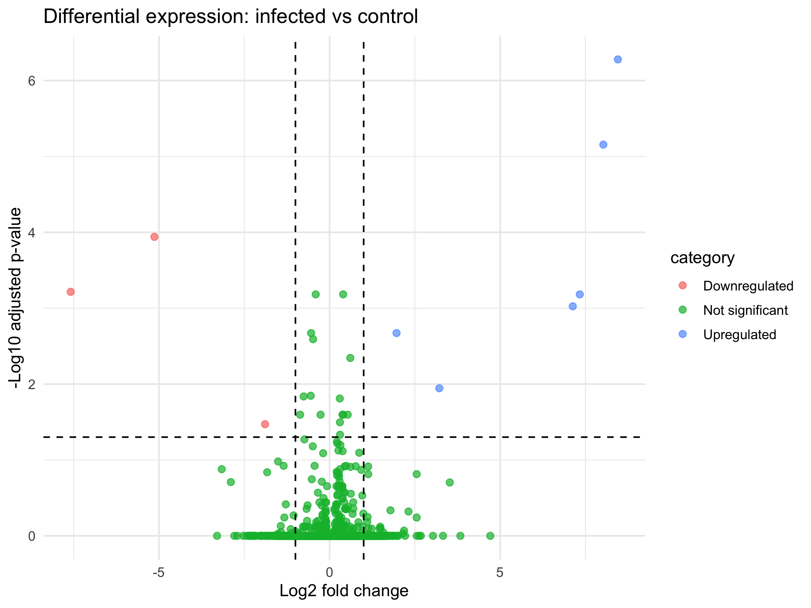
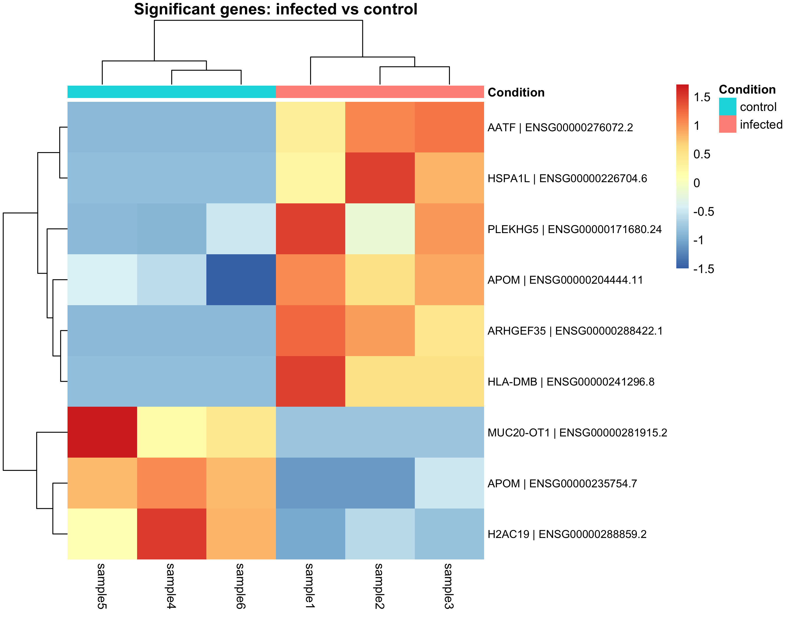
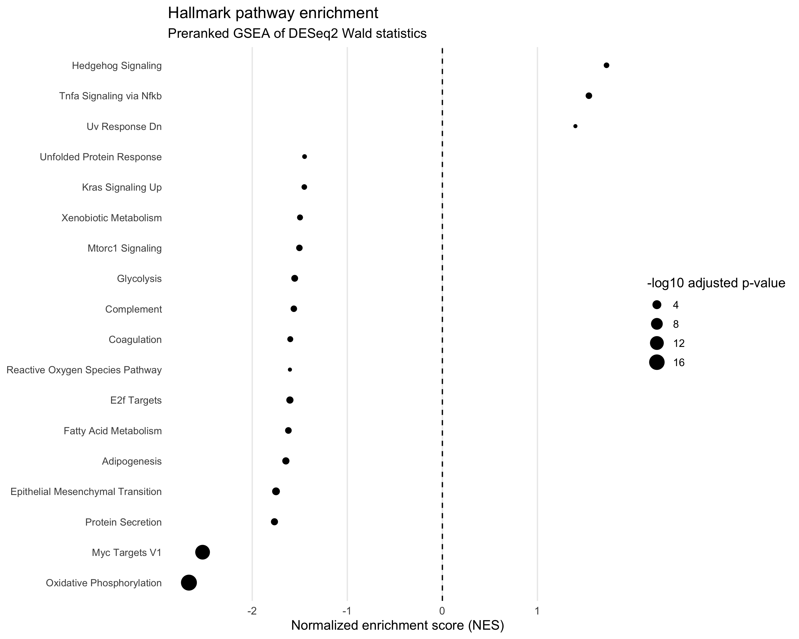

# RNA-seq Differential Expression Analysis of SARS-CoV-2-Infected Calu-3 Cells

A reproducible RNA-seq analysis pipeline using publicly available NCBI SRA data to investigate transcriptional differences between SARS-CoV-2-infected and control human Calu-3 cells at 6 hours post-infection.

## Project overview

This project analyzes paired-end RNA-seq data from the publicly available GEO dataset **GSE151513**.

The analysis focuses on six samples collected at **6 hours post-infection (6 hpi)**:

* 3 SARS-CoV-2-infected samples
* 3 control samples

The objective was to build an end-to-end RNA-seq workflow starting from raw sequencing data and progressing through quality assessment, transcript quantification, gene-level expression analysis, dimensionality reduction, differential expression, and visualization.

The project was developed as a practical bioinformatics portfolio project using Python and R.

## Biological question

**How does SARS-CoV-2 infection affect gene expression in human Calu-3 cells at 6 hours post-infection?**

The primary comparison is:

**Infected vs control**

with three biological replicates per condition.

## Dataset

Source: NCBI Gene Expression Omnibus / Sequence Read Archive

* GEO accession: **GSE151513**
* Organism: *Homo sapiens*
* Cell model: Calu-3
* Experimental condition: SARS-CoV-2 infection
* Time point analyzed: 6 hours post-infection
* Sequencing: paired-end RNA-seq

### Samples analyzed

| Sample  | SRA accession | GEO accession | Condition | Time point |
| ------- | ------------- | ------------- | --------- | ---------- |
| sample1 | SRR11884716   | GSM4579971    | Infected  | 6 h        |
| sample2 | SRR11884717   | GSM4579972    | Infected  | 6 h        |
| sample3 | SRR11884718   | GSM4579973    | Infected  | 6 h        |
| sample4 | SRR11884719   | GSM4579974    | Control   | 6 h        |
| sample5 | SRR11884720   | GSM4579975    | Control   | 6 h        |
| sample6 | SRR11884721   | GSM4579976    | Control   | 6 h        |

## Analysis workflow

```text
NCBI SRA
   ↓
SRA Toolkit
   ↓
Paired-end FASTQ files
   ↓
Custom Python quality control
   ↓
GENCODE v49 transcript reference
   ↓
Salmon transcript quantification
   ↓
tximport
   ↓
Gene-level expression matrix
   ↓
DESeq2
   ↓
 ┌───────────────┬───────────────┬────────────────┐
 │ PCA           │ Differential  │ Visualization  │
 │               │ expression    │                │
 │               │               │                │
 │               │ Volcano plot  │ Heatmap        │
 └───────────────┴───────────────┴────────────────┘
```

## Software and tools

### Data acquisition

* NCBI SRA Toolkit 3.4.1
* `prefetch`
* `fasterq-dump`

### Python

* Python 3
* pandas
* NumPy
* SciPy
* Matplotlib

Python was used for:

* FASTQ quality assessment
* Per-position Phred quality calculation
* GC-content calculation
* QC report generation
* QC visualization
* Gene-symbol mapping

### R

* R 4.4.2
* DESeq2
* tximport
* ggplot2
* pheatmap

R was used for:

* Transcript-to-gene expression import
* Gene-level expression analysis
* Variance-stabilizing transformation
* PCA
* Differential expression analysis
* Heatmap generation
* Volcano plot generation

## Quality control

A custom Python FASTQ parser was developed to calculate:

* Number of reads
* Total sequenced bases
* Average read length
* Mean Phred quality
* Percentage of bases below Q20
* GC content
* Average Phred quality at each read position

The six samples produced 12 paired-end FASTQ files in total.

The quality-control workflow was designed to assess sequencing quality before downstream transcript quantification.

### Example QC output

Quality-by-position plots are available in:

`results/qc/`

The corresponding numerical summaries are stored as CSV files.

### QC limitation

The custom QC analysis provides basic sequencing-quality metrics but does not replace comprehensive tools such as FastQC/MultiQC.

In particular, these metrics alone cannot establish the absence of adapter contamination, sequence duplication, rRNA contamination, or other library-specific technical biases.

## Transcript quantification

Transcript abundance was estimated using **Salmon 2.8.0** with paired-end FASTQ files and the GENCODE v49 human transcript reference.

The resulting `quant.sf` files were imported into R using **tximport** and summarized to gene-level expression estimates for downstream differential-expression analysis with DESeq2.

The GENCODE v49 reference used in this project is based on **GRCh38**. It differs from the reference annotation used in the original study, so the results should not be considered an exact reproduction of the original analysis.

Large reference files, the Salmon index, and Salmon quantification directories are excluded from Git to keep the repository manageable.

## Differential expression analysis

Gene-level expression was analyzed using **DESeq2**.

Low-count genes were filtered using:

* Minimum count of 10
* Present in at least 3 samples

After filtering:

* **18,619 genes** passed the low-count filter before DESeq2 results were generated
* **18,609 genes** were included in the exported differential-expression results after rows with missing adjusted p-values were excluded

The primary statistical comparison was:

**Infected vs control**

### Differential expression results

Using an adjusted p-value threshold of:

**padj < 0.05**

24 genes showed statistically significant differential expression.

Using the additional effect-size criterion:

**|log2 fold change| > 1**

9 genes met both criteria:

* 6 upregulated
* 3 downregulated

The complete DESeq2 results are available in:

`results/expression/DESeq2_infected_vs_control.csv`

A table containing gene symbols for the significant genes is available in:

`results/expression/DESeq2_significant_genes_with_symbols.csv`

## PCA

Principal component analysis was performed using a variance-stabilizing transformation of the gene-count data.

The first two principal components explained:

* **PC1: 28.1%**
* **PC2: 22.6%**
* **Combined: 50.7%**

The PCA provides an assessment of overall transcriptional variation among the six samples.

The samples do not show complete separation of infected and control groups across the whole transcriptome. This indicates that biological or technical variation remains substantial in this small dataset.

PCA results:

`results/pca/PCA_coordinates.csv`

PCA visualization:

`results/pca/PCA_plot.png`

## Differential-expression visualization

### Volcano plot

The volcano plot displays the relationship between log2 fold change and adjusted statistical significance.



The plot highlights genes meeting the predefined thresholds of:

* adjusted p-value < 0.05
* log2 fold change > 1 or < -1

### Heatmap

A heatmap was generated for the 9 genes satisfying both the adjusted p-value and effect-size thresholds.



The selected genes show a clearer condition-associated expression pattern than the whole-transcriptome PCA.

This difference is expected because the heatmap specifically focuses on genes identified as strongly associated with the infected-versus-control comparison.

## Significant genes

The nine genes meeting both statistical and effect-size thresholds were:

| Gene symbol | Ensembl gene ID    | log2 fold change | Direction |
| ----------- | ------------------ | ---------------: | --------- |
| ARHGEF35    | ENSG00000288422.1  |             8.45 | Up        |
| AATF        | ENSG00000276072.2  |             8.02 | Up        |
| APOM        | ENSG00000235754.7  |            -5.13 | Down      |
| MUC20-OT1   | ENSG00000281915.2  |            -7.59 | Down      |
| HLA-DMB     | ENSG00000241296.8  |             7.33 | Up        |
| HSPA1L      | ENSG00000226704.6  |             7.13 | Up        |
| PLEKHG5     | ENSG00000171680.24 |             1.96 | Up        |
| APOM        | ENSG00000204444.11 |             3.22 | Up        |
| H2AC19      | ENSG00000288859.2  |            -1.89 | Down      |

Gene symbols are provided for biological readability, while Ensembl gene IDs are retained as the primary identifiers.

Two different Ensembl gene identifiers map to **APOM** in the selected annotation. They were intentionally retained as separate identifiers rather than manually merged.

## Repository structure

The tree below summarizes the main project files and analysis outputs. Large raw sequencing files, the reference FASTA, and the Salmon index are stored locally and are not committed to GitHub.

```text
rna-seq-analysis/
├── data/
│   └── metadata.csv
├── reference/
│   └── GENCODE v49 transcript FASTA and Salmon index (local; not tracked)
├── scripts/
│   ├── create_gsea_interpretation.py
│   ├── create_sample_qc_table.py
│   ├── fastq_quality.py
│   ├── heatmap_analysis.R
│   ├── leading_edge_analysis.py
│   ├── map_gene_symbols.py
│   ├── pca_analysis.R
│   ├── plot_gsea.R
│   ├── plot_qc_from_csv.py
│   ├── ranked_pathway_analysis.R
│   ├── run_qc.py
│   ├── run_salmon.py
│   ├── summarize_qc.py
│   ├── summarize_salmon.py
│   ├── tximport_analysis.R
│   └── volcano_plot.R
└── results/
    ├── expression/
    │   ├── DESeq2_infected_vs_control.csv
    │   ├── DESeq2_significant_genes_with_symbols.csv
    │   ├── gene_abundance.csv
    │   ├── gene_counts.csv
    │   ├── gene_effective_lengths.csv
    │   ├── sample_metadata.csv
    │   ├── salmon_quantification_summary.csv
    │   └── tx2gene.csv
    ├── heatmap/
    │   ├── significant_genes_heatmap.png
    │   └── significant_genes_zscore.csv
    ├── pathway_analysis/
    │   ├── hallmark_gsea_interpretation.csv
    │   ├── hallmark_gsea_plot.png
    │   ├── hallmark_gsea_results.csv
    │   ├── hallmark_gsea_significant.csv
    │   ├── leading_edge_gene_summary.csv
    │   ├── leading_edge_genes.csv
    │   └── ranked_gene_list.csv
    ├── pca/
    │   ├── PCA_coordinates.csv
    │   └── PCA_plot.png
    ├── qc/
    │   ├── README.md
    │   ├── all_samples_qc_summary.csv
    │   └── per-sample quality summaries and plots
    └── volcano/
        ├── DESeq2_volcano_data.csv
        └── volcano_plot.png
```

**Note:** This is a summary of the key files, not a complete listing of every QC output. Raw FASTQ files and large reference/index files must be obtained or regenerated locally before the full workflow can be rerun.

## Reproducibility

This repository contains the analysis scripts, sample metadata, and selected results. Raw sequencing files, the reference transcript FASTA, the Salmon index, and Salmon quantification directories are excluded from Git because of their size. The complete workflow therefore requires downloading the input data and preparing the reference locally.

### 1. Sample metadata

The six SRA accessions and their experimental conditions are listed in `data/metadata.csv`. The analysis compares three SARS-CoV-2-infected samples with three control samples at 6 hours.
### 2. Obtain the sequencing data
#Install the [NCBI SRA Toolkit](https://github.com/ncbi/sra-tools) and create the raw-data directory:

```bash
mkdir -p data/raw
mkdir -p data/sra
```

Download each SRA accession into the project directory:

```bash
for sample in SRR11884716 SRR11884717 SRR11884718 SRR11884719 SRR11884720 SRR11884721; do
    prefetch "$sample" --output-directory data/sra
done
```

Convert each downloaded accession to paired FASTQ files:

```bash
for sample in SRR11884716 SRR11884717 SRR11884718 SRR11884719 SRR11884720 SRR11884721; do
    fasterq-dump "data/sra/$sample/$sample.sra" \
        --split-files \
        --outdir data/raw
done
```

The conversion should create two files per sample, ending in `_1.fastq` and `_2.fastq`. These filenames are expected by `scripts/run_salmon.py`.

**Storage note:** The six samples occupied approximately 83 GB after FASTQ conversion in the original analysis. Allow additional disk space for the downloaded SRA files and intermediate processing.

### 3. Prepare the reference and Salmon index

Obtain the GENCODE v49 human transcript FASTA and save it as:

`reference/gencode.v49.transcripts.fa`

Build the Salmon index using the same Salmon version used for this analysis, where possible:

```bash
mkdir -p reference/salmon_index
salmon index \
    -t reference/gencode.v49.transcripts.fa \
    -i reference/salmon_index
```

The project uses GENCODE v49 on GRCh38. This differs from the reference annotation used in the original study, so the analysis is not intended as an exact reproduction of the original pipeline.

### 4. Run quality control and transcript quantification

From the project root, run:

```bash
python scripts/run_qc.py
python scripts/run_salmon.py
```

The QC workflow generates basic FASTQ quality summaries and plots. Salmon quantification is written to `results/salmon/`. The quantification script skips samples that already have a `quant.sf` file.

### 5. Run downstream analysis

Run the following commands from the project root, after Salmon quantification has completed and the required R packages are installed.

First, import transcript-level quantification and perform gene-level differential-expression analysis:

```bash
Rscript scripts/tximport_analysis.R
```

Then generate the PCA, volcano plot, and heatmap:

```bash
Rscript scripts/pca_analysis.R
Rscript scripts/volcano_plot.R
Rscript scripts/heatmap_analysis.R
```

Next, run ranked Hallmark gene-set enrichment using the DESeq2 results:

```bash
Rscript scripts/ranked_pathway_analysis.R
```

Finally, generate the pathway figure and interpretation table:

```bash
Rscript scripts/plot_gsea.R
python scripts/create_gsea_interpretation.py
```

The scripts use paths relative to the project root and depend on outputs created by earlier steps. If a script reports a missing input file, confirm that the preceding step completed successfully and produced the expected output before continuing.

The main outputs include:

* `results/expression/DESeq2_infected_vs_control.csv`
* `results/pca/PCA_plot.png`
* `results/volcano/volcano_plot.png`
* `results/heatmap/significant_genes_heatmap.png`
* `results/pathway_analysis/hallmark_gsea_results.csv`
* `results/pathway_analysis/hallmark_gsea_plot.png`
* `results/pathway_analysis/hallmark_gsea_interpretation.csv`

### 6. Reproducibility considerations

* Run commands from the project root unless a script specifies otherwise.
* Confirm that the expected input files and reference index exist before running downstream steps.
* Large input files and intermediate outputs are intentionally excluded from Git.
* Results may differ slightly with changes in software versions, transcript annotations, or package dependencies.
* The custom QC workflow provides basic metrics and does not replace comprehensive FastQC/MultiQC analysis.
## Limitations

Several limitations should be considered when interpreting these results:

1. **Small sample size:** Only six samples were analyzed, with three biological replicates per condition. This limits statistical power and generalizability.
2. **Single time point:** The dataset represents only 6 hours post-infection and cannot describe how gene-expression patterns change over time.
3. **Sequencing quality control:** The custom QC workflow provides basic sequencing metrics rather than a comprehensive FastQC/MultiQC assessment. These metrics alone cannot establish the absence of adapter contamination, duplication, rRNA contamination, or other library-specific biases.
4. **No adapter trimming:** Adapter detection and trimming were not included in the current workflow.
5. **Sample variation:** PCA showed substantial variation among samples and did not produce clear separation of all samples by condition. This warrants caution when interpreting differential-expression and pathway results.
6. **Limited significant-gene set:** Only a small number of genes met both the statistical-significance and effect-size thresholds.
7. **Reference annotation differences:** The analysis uses GENCODE v49 based on GRCh38 rather than exactly reproducing the original study's reference annotation.
8. **Exploratory interpretation:** The results describe this selected subset of samples, not a definitive characterization of the complete SARS-CoV-2 response.
9. **No independent validation:** The findings have not been independently validated in an additional dataset or experimental system. Additional biological replicates and independent validation would strengthen the conclusions.
10. **Pathway-enrichment interpretation:** Hallmark gene sets are broad biological signatures. Enrichment indicates that genes from a set are disproportionately represented toward one end of the ranked list; it does not mean every gene changes in the same direction or that the entire pathway is activated or inhibited.

## Future improvements

Potential extensions include:

* Performing comprehensive FastQC/MultiQC analysis.
* Assessing adapter content and evaluating adapter trimming.
* Comparing results with an alignment-based quantification workflow.
* Reproducing the analysis with the original study's reference annotation and analytical pipeline.
* Incorporating additional biological replicates and time points.
* Investigating batch effects and other potential technical variables.
* Validating selected findings using an independent dataset.
* Exploring leading-edge genes from significant Hallmark gene sets.

## Project objective

The primary purpose of this project was to develop practical experience with an end-to-end RNA-seq workflow, including:

**raw sequencing data → quality control → transcript quantification → gene-level expression → statistical testing → visualization → biological interpretation**

The project emphasizes reproducibility, explicit documentation of analytical decisions, and cautious interpretation of results rather than treating statistical significance alone as evidence of biological importance.
## Ranked Pathway Enrichment Analysis

### Objective

To investigate biological processes associated with SARS-CoV-2 infection, I performed preranked Gene Set Enrichment Analysis (GSEA) using the complete set of gene-level differential-expression statistics rather than restricting the analysis to individually significant genes.

### Method

* **Input:** DESeq2 differential-expression results for 18,609 genes.
* **Ranking metric:** DESeq2 Wald test statistic, ranked from highest to lowest.
* **Gene sets:** MSigDB Hallmark collection for *Homo sapiens*, accessed using `msigdbr`.
* **Enrichment analysis:** `fgsea`, with a minimum gene-set size of 15 and a maximum of 500.
* **Multiple testing:** Benjamini–Hochberg-adjusted p-values.
* **Significance threshold:** Adjusted p-value < 0.05.
* **Visualization:** Normalized enrichment scores (NES) plotted for significant pathways.

The analysis used the Wald statistic to retain information about both the direction and strength of differential expression across the ranked gene list. Positive NES values indicate enrichment toward the infected condition; negative NES values indicate enrichment toward the control condition.

### Results

Eighteen Hallmark pathways met the adjusted p-value threshold of 0.05.

The strongest enrichment patterns included:

| Pathway                         |    NES | Adjusted p-value | Direction |
| ------------------------------- | -----: | ---------------: | --------- |
| Oxidative phosphorylation       | -2.666 |     7.52 × 10⁻¹⁸ | Control   |
| MYC targets V1                  | -2.522 |     8.87 × 10⁻¹⁵ | Control   |
| TNFα signaling via NF-κB        |  1.541 |      8.66 × 10⁻³ | Infected  |
| Hedgehog signaling              |  1.727 |      2.24 × 10⁻² | Infected  |
| Glycolysis                      | -1.553 |      5.81 × 10⁻³ | Control   |
| Fatty-acid metabolism           | -1.620 |      7.59 × 10⁻³ | Control   |
| Unfolded protein response       | -1.450 |      3.58 × 10⁻² | Control   |
| Reactive oxygen species pathway | -1.604 |      4.01 × 10⁻² | Control   |

*Negative NES indicates enrichment toward the control side of the ranked gene list, not necessarily that every gene in the pathway is downregulated.*

### Interpretation

The preranked GSEA results identify differences in the distribution of gene-expression statistics between the infected and control samples. Eighteen Hallmark gene sets met the Benjamini–Hochberg-adjusted significance threshold of 0.05. These findings are exploratory and should be interpreted alongside the small sample size and sample-level variability.

1. **Inflammatory-response-associated transcription:** TNFα signaling via NF-κB was enriched toward the infected condition (NES = 1.541, adjusted p = 0.0087). This is consistent with differences in inflammatory-response-associated gene expression between the groups, but enrichment alone does not establish that the entire pathway was activated.

2. **Oxidative phosphorylation and metabolic signatures:** Oxidative phosphorylation showed the strongest enrichment in the analysis toward the control condition (NES = -2.666, adjusted p = 7.52 × 10⁻¹⁸). MYC targets V1, glycolysis, and fatty-acid metabolism were also enriched toward controls. Together, these results indicate that genes associated with energy metabolism and cellular growth were distributed differently across the infected-versus-control ranked list. They do not, by themselves, demonstrate a change in metabolic activity.

3. **Additional cellular programs:** Hedgehog signaling was enriched toward the infected condition (NES = 1.727, adjusted p = 0.0224), while the unfolded protein response and reactive oxygen species pathway were enriched toward controls. These signatures identify potential directions for follow-up analysis, rather than proving specific cellular mechanisms.

4. **Statistical and biological context:** The experiment includes three samples per condition at a single time point. The PCA did not show clear separation of all samples by condition, indicating that sample variability should be considered when interpreting the differential-expression and enrichment results. The significant pathways are hypotheses for further investigation, not definitive evidence of causal effects of infection.

**Interpretation of enrichment direction:** Positive normalized enrichment scores (NES) indicate enrichment toward the infected end of the ranked gene list, whereas negative NES values indicate enrichment toward the control end. Enrichment does not mean that every gene in a gene set changes in the same direction, and it should not automatically be described as pathway activation or inhibition.

Useful follow-up analyses would include examining leading-edge genes that contribute most to each enrichment signal, reviewing sample-level expression patterns, and checking whether the main findings are consistent in an independent dataset.

### Leading-edge gene analysis

To investigate which genes contributed to the significant Hallmark pathway enrichment results, I extracted the leading-edge genes reported by `fgsea` for each pathway with a Benjamini–Hochberg adjusted p-value below 0.05.

The analysis maps Ensembl gene identifiers to gene symbols using the GENCODE v49 transcript reference and joins the leading-edge genes to the DESeq2 differential-expression statistics. It also summarizes genes that recur across multiple enriched pathways.

**Summary of results**

* 18 significant Hallmark pathways were examined.
* 899 pathway–gene entries were extracted, representing 707 unique genes.
* All 899 entries had mapped gene symbols and corresponding DESeq2 statistics.
* Only two pathway–gene entries had an individual-gene adjusted p-value below 0.05. This illustrates that significant pathway enrichment does not require every contributing gene to be individually significant.

The findings should be interpreted at both the pathway and individual-gene levels. Repeated appearance in several leading-edge sets indicates overlap between pathway gene sets; it does not independently establish a gene's biological importance or causality.

**Outputs**

* `results/pathway_analysis/leading_edge_genes.csv` — pathway-level leading-edge genes with pathway enrichment statistics and individual-gene differential-expression results.
* `results/pathway_analysis/leading_edge_gene_summary.csv` — genes recurring across pathways, including their pathway counts and associated DESeq2 statistics.

**Run the analysis**

```bash
python scripts/leading_edge_analysis.py
```

The script uses the Hallmark GSEA results, the DESeq2 infected-versus-control results, and the GENCODE v49 transcript reference. The reference and large sequencing files are not included in the Git repository and must be prepared separately.

**Examples linking gene-level and pathway-level results**

Two individually significant genes were also present in leading-edge sets from significant Hallmark pathways:

* **BRCA2** (log₂ fold change = −0.482; adjusted p = 0.00256) appeared in `HALLMARK_E2F_TARGETS`, which was enriched toward the control end of the ranked gene list (NES = −1.604).
* **CCNL1** (log₂ fold change = +0.300; adjusted p = 0.0155) appeared in `HALLMARK_TNFA_SIGNALING_VIA_NFKB`, which was enriched toward the infected end (NES = +1.541).

These examples connect individual differential-expression results with pathway-level enrichment. They do not establish that either gene drives its associated pathway. Given the small sample size, the findings remain exploratory and require validation in an independent dataset.


### Reproducibility and outputs

The analysis scripts and selected outputs are available in this repository:

* `scripts/ranked_pathway_analysis.R` — performs preranked Hallmark GSEA.
* `scripts/plot_gsea.R` — generates the pathway enrichment plot.
* `scripts/create_gsea_interpretation.py` — generates a readable pathway interpretation table.
* `results/pathway_analysis/hallmark_gsea_plot.png` — visualization of significant pathways.
* `results/pathway_analysis/hallmark_gsea_significant.csv` — significant pathway results.
* `results/pathway_analysis/hallmark_gsea_interpretation.csv` — pathway directions, statistics, and descriptive interpretations.
### Running the analysis

Follow the main [Reproducibility instructions](#reproducibility) above for the complete workflow, including data acquisition, reference preparation, quality control, Salmon quantification, differential expression analysis, and pathway enrichment.

#### Leading-edge gene analysis

After running the upstream analysis, ensure the following inputs are available:

- `results/pathway_analysis/hallmark_gsea_results.csv`
- `results/expression/DESeq2_infected_vs_control.csv`
- `reference/gencode.v49.transcripts.fa`

Activate the Python environment and run:

```bash
source .venv/bin/activate
python -m pip install -r requirements.txt
python scripts/leading_edge_analysis.py
```

The script produces:

- `results/pathway_analysis/leading_edge_genes.csv`
- `results/pathway_analysis/leading_edge_gene_summary.csv`

These outputs connect genes in enriched Hallmark pathways with their differential-expression statistics. Pathway enrichment does not establish that an individual gene causes or independently drives a pathway-level effect.

#### Reproducibility notes

- Raw sequencing files, the transcript reference, the Salmon index, and large intermediate quantification files are excluded from version control.
- `environment_versions.txt` records key software versions for reference; it is not a complete environment lockfile.
- Re-running the full workflow requires the appropriate Python dependencies, R packages (including `tximport`, DESeq2, `fgsea`, and `msigdbr`), and command-line tools such as Salmon and the SRA Toolkit.
- The analysis uses three infected and three control samples at 6 hours post-infection. The small sample size and limited separation in the PCA warrant cautious interpretation.
- The project uses GENCODE v49 rather than the original study's reference, so results may differ from the original analysis.
