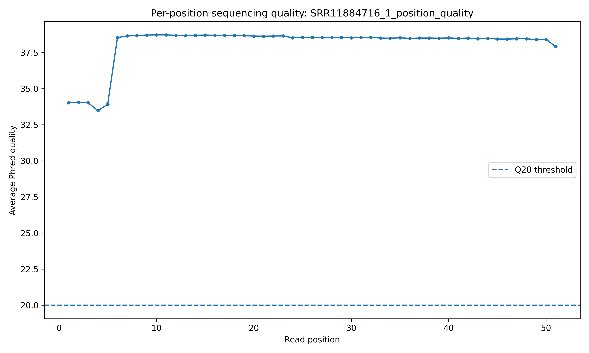
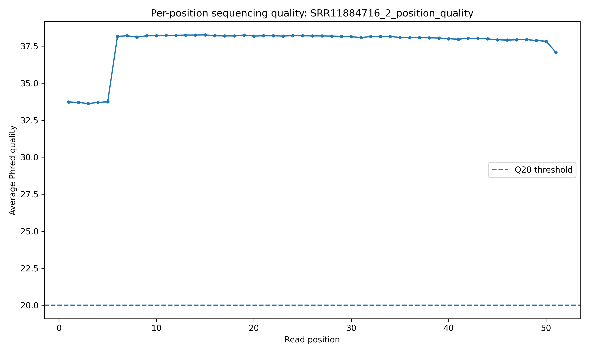

# RNA-seq Quality Control

This directory contains quality-control summaries and per-position quality plots for the six paired-end RNA-seq samples analyzed in this project.

## Input data

The RNA-seq data were obtained from the NCBI Sequence Read Archive (SRA) as paired-end FASTQ files.

Six samples were analyzed:

| SRA accession | GEO accession | Condition | Timepoint |
| ------------- | ------------- | --------- | --------- |
| SRR11884716   | GSM4579971    | Infected  | 6 h       |
| SRR11884717   | GSM4579972    | Infected  | 6 h       |
| SRR11884718   | GSM4579973    | Infected  | 6 h       |
| SRR11884719   | GSM4579974    | Control   | 6 h       |
| SRR11884720   | GSM4579975    | Control   | 6 h       |
| SRR11884721   | GSM4579976    | Control   | 6 h       |

Each sample contains paired-end Read 1 (R1) and Read 2 (R2) FASTQ files, giving 12 FASTQ files in total.

## QC method

FastQC could not be used in the project environment because its Java dependency was unavailable. Instead, a custom Python QC workflow was developed to calculate:

* Number of reads
* Total bases
* Average read length
* Mean Phred quality
* Percentage of bases below Q20
* GC content
* Per-position average Phred quality

The main QC scripts are:

```text
scripts/fastq_quality.py
scripts/run_qc.py
scripts/plot_qc_from_csv.py
scripts/summarize_qc.py
scripts/create_sample_qc_table.py
```

The custom approach provides basic sequencing-quality metrics but is not intended to replace the broader set of diagnostics provided by established QC tools such as FastQC and MultiQC.

## Six-sample QC summary

| Sample      | R1 mean Phred | R2 mean Phred | R1 bases <Q20 | R2 bases <Q20 |  R1 GC |  R2 GC |
| ----------- | ------------: | ------------: | ------------: | ------------: | -----: | -----: |
| SRR11884716 |         38.09 |         37.66 |         1.75% |         2.81% | 50.15% | 50.61% |
| SRR11884717 |         38.08 |         37.60 |         1.75% |         2.95% | 50.09% | 50.51% |
| SRR11884718 |         38.10 |         37.09 |         1.74% |         4.12% | 50.08% | 50.46% |
| SRR11884719 |         38.10 |         37.43 |         1.75% |         3.37% | 50.33% | 50.77% |
| SRR11884720 |         38.09 |         37.59 |         1.75% |         2.96% | 50.09% | 50.57% |
| SRR11884721 |         38.10 |         37.72 |         1.74% |         2.71% | 50.19% | 50.56% |

## QC interpretation

All six samples show similar overall sequencing characteristics.

Read 1 quality is highly consistent, with mean Phred scores of approximately 38 across all samples. Read 2 has slightly lower mean quality, ranging from 37.09 to 37.72.

The proportion of bases below Q20 remains relatively low across the dataset. Read 2 of SRR11884718 has the highest proportion below Q20 at 4.12%, but its overall mean Phred quality remains high.

GC content is also highly consistent, remaining close to 50% for both reads across all six samples.

Based on these basic QC metrics, no sample shows an obvious severe sequencing-quality failure that would justify removing it before downstream analysis.

## Per-position quality plots

Per-position average Phred quality was calculated separately for every FASTQ file.

Examples:





The corresponding CSV files contain the numerical per-position quality values and can be used for further analysis or plotting.

## Output files

For each FASTQ file, the QC workflow produces:

```text
*_qc.csv
*_position_quality.csv
*_position_quality.png
```

The six-sample summary is:

```text
sample_qc_summary.csv
```

A separate aggregate summary containing all 12 FASTQ files is also available:

```text
all_samples_qc_summary.csv
```

## Reproducibility

The QC analysis can be reproduced from the project root with:

```bash
python scripts/run_qc.py
python scripts/plot_qc_from_csv.py
python scripts/summarize_qc.py
python scripts/create_sample_qc_table.py
```

The scripts operate on FASTQ files located in:

```text
data/raw/
```

The raw FASTQ files are intentionally excluded from GitHub because of their large size.

## Limitations

This custom QC workflow provides basic sequencing-quality measurements but does not perform adapter detection, sequence duplication analysis, overrepresented-sequence analysis, contamination screening, or other diagnostics available through established RNA-seq QC packages.

For a production analysis, FastQC/MultiQC or an equivalent validated QC workflow would be preferable.

The current QC was therefore used as a transparent, reproducible quality assessment of the downloaded reads rather than as a replacement for a complete production-grade QC pipeline.
